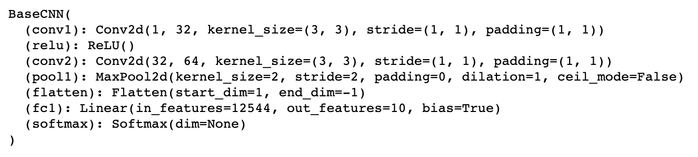

# CS6220 HW2 (Performance Tuning for CNNs)

## How this repo is structured
1. `models`: This contains the state dict of all 5 models in `.pt` format. 
2. `screenshots`: This contains screenshots of the execution process (training, testing) and the confusion matrices for all 5 models.
3. `experiments.ipynb`: This is where all the magic happens. Remember to go through setup before running the cells in the notebook.
4. `env.txt`: This is the text file that contains the conda environment configuration.
5. `Analytical Report.pdf`: Contains the final report for the assignment.

## Setup
To set up the conda environment, run `conda env create --file env.txt` while in the root repository.

## Models
All of the models were trained using the same CNN architecture:

1. `basecnn-default`: This is trained under the default hyperparameter configurations specified in the report.
2. `basecnn-0.1-5`: This is trained with a learning rate of 0.1 for 5 epochs.
3. `basecnn-0.1-8`: This is trained with a learning rate of 0.1 for 8 epochs.
4. `basecnn-0.01-5`: This is trained with a learning rate of 0.01 for 5 epochs.
5. `basecnn-0.01-8`: This is trained with a learning rate of 0.01 for 8 epochs.

Note that these names apply to both the `models` and the `screenshots` directory.

To load any of these models, run the following two lines of code in `experiments.ipynb`:
`model = BaseCNN()`
`model.load_state_dict(torch.load(<MODEL_PATH>))`